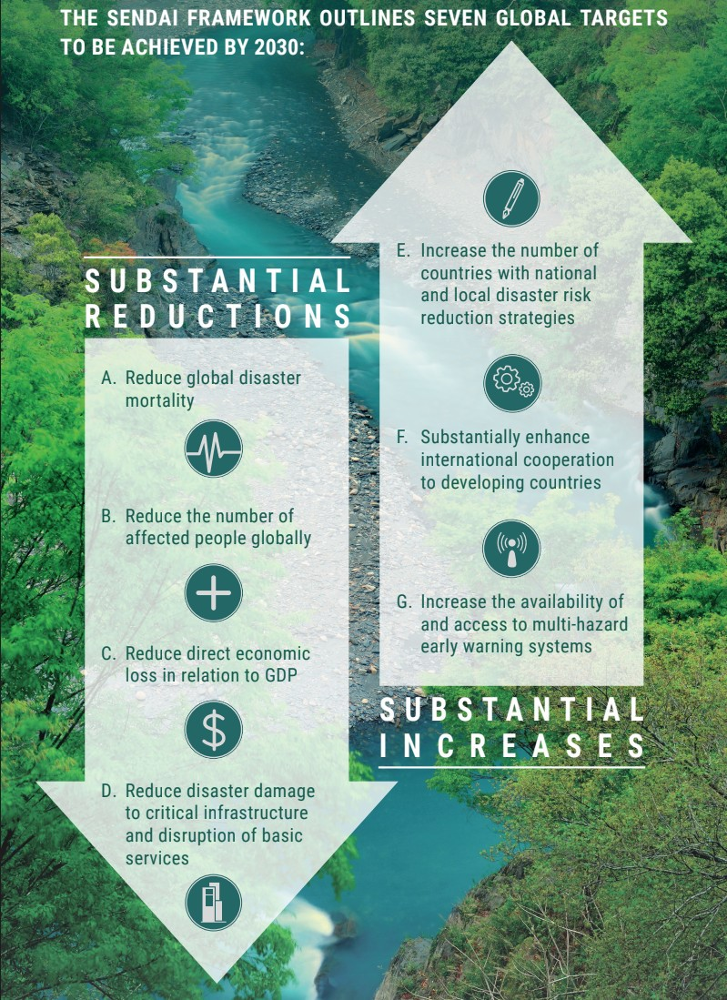
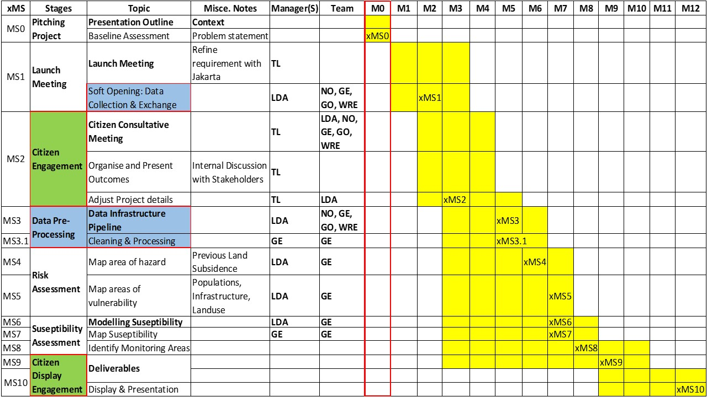

```{r echo=FALSE, warning=FALSE}
#remotes::install_github("ropensci/RefManageR")
library(RefManageR)
BibOptions(check.entries = FALSE,
           bib.style = "authoryear",
           cite.style = "authoryear",
           style = "markdown",
           hyperlink = TRUE,
           dashed = FALSE,
           no.print.fields=c("doi", "url", "urldate", "issn"))
myBib <- ReadBib("bib_group_pres.bib", check = FALSE)
```

```{r xaringan-all, echo=FALSE, warning=FALSE, include=FALSE}

library(readxl)
library(dplyr)
library(xaringan)
library(xaringanExtra)
library(knitr)
library(knitcitations)

hook_source <- knitr::knit_hooks$get('source')
knitr::knit_hooks$set(source = function(x, options) {
  x <- stringr::str_replace(x, "^[[:blank:]]?([^*].+?)[[:blank:]]*#<<[[:blank:]]*$", "*\\1")
  hook_source(x, options)
})

xaringanExtra::use_broadcast()
xaringanExtra::use_freezeframe()
xaringanExtra::use_scribble()
#xaringanExtra::use_slide_tone()
xaringanExtra::use_search(show_icon = TRUE, auto_search	=FALSE)
xaringanExtra::use_freezeframe()
xaringanExtra::use_clipboard()
xaringanExtra::use_tile_view()
xaringanExtra::use_panelset()
xaringanExtra::use_editable(expires = 1)
xaringanExtra::use_fit_screen()
xaringanExtra::use_extra_styles(
  hover_code_line = TRUE,         
  mute_unhighlighted_code = TRUE  
)

```

# The significance of Jakarta

.panelset.sideways[

.panel[.panel-name[Jakarta as capital]

* Jakarta is home to significant financial institutions like the Indonesia Stock Exchange and the Bank of Indonesia, along with serving as the corporate headquarters for numerous Indonesian companies and multinational corporations. This underscores its pivotal role in the country's economy.

]

.panel[.panel-name[Area]

* The area of Jakarta is 661.5km2 and is divided to five administrative cities of South Jakarta, Central Jakarta, East Jakarta, West Jakarta, and North Jakarta.

]

.panel[.panel-name[Population]

* Total population is 10 million within the city, while the total population of the entire metro area is 30 million. 

]
]

  
---
```{r xaringan-all, echo=FALSE, warning=FALSE}
```

## Highlighting the problem 

.panelset[

.panel[.panel-name[The Sinking Capital]

* Jakarta, the capital of Indonesia, has been at risk of becoming the first megacity to completely sink. This is attributed to factors such as rising sea levels, land subsidence, construction on soft sediments, and natural sediment compaction. 

* The northern part of Jakarta currently sits approximately 2.5 meters below sea level, with estimates indicating that by 2050, 40% of the area will be sunk. Each year, Jakarta experiences between 1 to 10 sinking incidents. 

]

.panel[.panel-name[NCICD]

* To protect Jakarta from coastal flooding, the National Capital Integrated Coastal Development (NCID) was developed, with the main plan surrounding the construction of a sea wall which could reach 32km in length `r Citet(myBib,"GiantSeaWall")`.


]

.panel[.panel-name[The Main Cause]

* Land subsidence in Jakarta displays spatial and temporal variations, typically occurring at rates of approximately 3 to 10 centimetre's per year. 

* Currently, detailed understanding of the characteristics and mechanisms of land subsidence in Jakarta, both spatially and temporally, remains incomplete. 

* Accurately estimating and modelling the contribution of each causative factor to observed land subsidence in specific areas is still necessary.

]
]

---
## Global agendas and goals 1
###  The Sendai Framework for Disaster Risk Reduction (2015)

.pull-left[
```{r echo=FALSE, out.width="80%"}

```
]
.pull-right[


* To understand disaster risk

* To reduce vulnerability of coastal regions by enhancing resilience capacity e.g., preparedness to disasters

* To strengthen local governance towards disaster risk management in accordance with this global framework -- a top down approach

* Recognises the state has the primary role for DRR

* Stakeholders should share the responsibility with the state


]
---
## Global agendas and goals 2
### Sustainable Development Goals (SDGs)
.panelset[
.panel[.panel-name[SDG 6]

.pull-left[

```{r echo=FALSE, out.width="80%"}
knitr::include_graphics("E_PRINT_06.jpg")
```
]
.pull-right[
**Target 6.4**

* By 2030, substantially increase water-use efficiency across all sectors and ensure sustainable withdrawals and supply of freshwater to address water scarcity and substantially reduce the number of people suffering from water scarcity
]


]

.panel[.panel-name[SDG 11]
.pull-left[

```{r echo=FALSE, out.width="80%"}
knitr::include_graphics("E_PRINT_11.jpg")
```
]
.pull-right[
**Target 11.3**

* By 2030, enhance inclusive and sustainable urbanization and capacity for participatory, integrated and sustainable human settlement planning and management in all countries
]


]

.panel[.panel-name[SDG 13]
.pull-left[

```{r echo=FALSE, out.width="80%"}
knitr::include_graphics("E_PRINT_13.jpg")
```
]
.pull-right[
**Target 13.1**

* Strengthen resilience and adaptive capacity to climate-related hazards and natural disasters in all countries

**Target 13.2**
* Integrate climate change measures into national policies, strategies and planning

]

]


.panel[.panel-name[SDG 15]
.pull-left[
```{r echo=FALSE, out.width="80%"}
knitr::include_graphics("E_PRINT_15.jpg")
```
]
.pull-right[
**Target 15.3**

* By 2030, combat desertification, restore degraded land and soil, including land affected by desertification, drought and floods, and strive to achieve a land degradation-neutral world
]
]
]

---
```{r echo=FALSE, fig.width=5, warning=FALSE}


```

## Causes of Subsidence

.pull-left[
* Physical factors: earthquakes. Indonesia is located on destructive plate boundaries where earthquakes happen frequently (Bott et al., 2021).

* Human/ social factors: groundwater extraction, rapid urban development, improper agricultural practices (Adibin et al., 2011)

* Natural consolidation of alluvium soil, load of infrastructures and constructions, and tectonic activities 

]


.pull-right[


]

---
```{r xaringan-all, echo=FALSE, warning=FALSE}
```

## Impact of land subsidence  

.panelset[

.panel[.panel-name[Infrastructure]

* Cracking of permanent constructions and roads.

* Tilting of houses and buildings.

* “Sinking” of houses and buildings.

* Breaking of underground pipelines and utilities.

* Malfunction of sewerage and drainage system 
 
* Deterioration in function of building and infrastructures

]

.panel[.panel-name[Environment]

* Changes in river canal and drain flow systems indirect.

* Frequent coastal flooding.

* Wider expansion of flooding areas. 

* Inundated areas and infrastructures.

* Increased inland sea water intrusion.

* Deterioration in quality of environmental condition

]

.panel[.panel-name[Economic]

* Increase in maintenance cost of infrastructure.

* decrease in land and property values.

* Abandoned buildings and facilities.

* Disruption to economic activities
]

.panel[.panel-name[Social]

* Deterioration in quality of living environment and life health and 

* Possibility of seawater intrusion to the lowered groundwater table, thus lack of clean water supply


* Disruption to daily activities of people.
]
]

---
```{r xaringan-all, echo=FALSE, warning=FALSE}
```

## Benefits to Addressing Land Subsidence

- Reduced loss of land.

- Reduced damage to infrastructure such as roads and buildings.

- Reduced flood risk.

- Protection of businesses and industry such as coastal tourism. 

- To ensure clean groundwater supply by avoiding seawater intrusion to groundwater table

---
## Criticism to the wall approach
.pull-left[
* Sea wall requires frequent maintenance from coastal erosion and destroy the natural landscape of Jakarta Bay (Nunn et al., 2021)

* It can only provide coastal defense but it’s unable to solve the root cause of the problem which is land subsidence.

* High cost of construction and maintenance. 

* Sea wall may create conflict with the dynamic coastal nature and block the sediment exchange between land and sea.
]

.pull-right[

* Can disrupt natural shoreline  processes and ruin coastal habitats such as mangrove and intertidal beaches.

* The build of the sea wall can have a terrible impact on the socio-economic aspect of Jakarta city.

]
---
```{r xaringan-all, echo=FALSE, warning=FALSE}
```

## Objectives

- Support the National Capital Integrated Coastal Development Project by providing data-driven monitoring and improved decision-making on land subsidence.

  - Producing a land subsidence susceptibility map for better monitoring
  - Producing a land subsidence risk map to help tackle problem areas
  
- Using these products:

  - Identify areas that require careful monitoring and deployment of continuous global positioning systems. 
  - Provide evidence-based recommended action on sustainable water management and infrastructure zoning.
  - Comply with relevant national and international policies to intervene as appropriate. 


---
## Methodology: Workflow

```{r echo=FALSE, out.width='95%', fig.align='center', fig.cap=''}
knitr::include_graphics('methodology_workflow.png')

```

---
## Methodology: Identifying Monitoring Areas

1. Split the remotely sensed data on previous land subsidence and influential environmental factors into training (70%) and testing (30%).

1. Preprocess the data including building raster maps for each variable. 

1. Employ Random Forest algorithm with cross validation to map land subsidence susceptibility.

1. Perform a permutation feature importance analysis to measure the contribution of each feature to the model.

1. Validate the model using the testing data. 

1. Map out land subsidence susceptibility that identifies areas of very high, high, moderate, low and very low susceptibility. 

---
## Methodology: Risk Mapping 

1. Preprocess land subsidence and social data to create raster maps.

1. Use Analytical Hierarchical Process (AHP) to calculate relative weights on both the land subsidence data and social data to indicate hazard and vulnerability. 

1. Produce hazard and vulnerability maps using the calculated weights. 

1. Combine hazard and vulnerability maps by producing a risk index.

1. Using risk index, produce a risk map showing areas at very high risk, high risk, moderate risk, low risk and very low risk.

---
## Data

.panelset[
.panel[.panel-name[Conditional Settings]

```{r echo=FALSE, message=FALSE, warning=FALSE}
library(tidyverse)
library(knitr)
library(readxl)
library(kableExtra)
library(here)

cond <- read_excel(here("Conditional_factors.xlsx"))


# Display the table using kableExtra with styling
cond %>%
  
  knitr::kable(format = 'html')%>%
  kable_styling(full_width = FALSE, font_size = 10)
```
]

.panel[.panel-name[Previous Land Subsidence]
```{r echo=FALSE, message=TRUE, warning=TRUE}
hist <- read_excel("Historical_LS.xlsx")


# Display the table using kableExtra with styling
hist %>%
  knitr::kable(format = 'html') %>%
  kable_styling(full_width = FALSE, font_size = 12)
```
]

.panel[.panel-name[Socio-economic Settings]
```{r echo=FALSE, message=FALSE, warning=FALSE}
socioecon <- read_excel("Socio_economic.xlsx")


# Display the table using kableExtra with styling
socioecon %>%
  knitr::kable(format = 'html') %>%
  kable_styling(full_width = FALSE, font_size = 12)
```
]
]
---
## Example Outputs

.pull-left[

Susceptibility Map 

```{r echo=FALSE, out.width='90%', fig.align='center', fig.cap=''}
knitr::include_graphics('eg_susceptibility.png')

```

From: `r Citet(myBib,"gharechaeeLandSubsidenceSusceptibility2023")`

]

.pull-right[

Risk Map 

```{r echo=FALSE, out.width='87%', fig.align='center', fig.cap=''}


```

From: `r Citet(myBib,"bhattaraiRiskAssessmentLand2017")`
]


---
```{r xaringan-all, echo=FALSE, warning=FALSE}
```
class: center, top

## Recommended Action Plan


```{r echo=FALSE, out.width='100%', fig.align='center'}

knitr::include_graphics('SlideRA.jpg')

```

---
## Resource Allocation

```{r echo=FALSE, out.width='100%', fig.align='center'}


```

---

## Project: Gantt Chart

Jakarta Susceptibility/ Risk Assessment Gantt Chart
- Experts: TL<sup>1</sup>, LDA<sup>2</sup>, GE<sup>3</sup>, GO<sup>4</sup>, WRE<sup>5</sup>, NO<sup>6</sup>.

```{r echo=FALSE, out.width='90%', fig.align='center'}



```
.footnote[
.pull-left[
- [1] Team Leader
- [2] Lead Data Analyst
- [3] Geo-spatial Expert
]
.pull-right[
- [4] Geologist
- [5] Water Resource Expert
- [6] Nodal Officer
]
]

---
class: center, top
### Budget Breakdown
```{r echo=FALSE, message=FALSE, warning=FALSE}
library(tidyverse)
library(knitr)
library(readxl)
library(kableExtra)
library(here)
# Read data from budget.xlsx
budget <- read_excel(here("budget.xlsx"))


# Display the table using kableExtra with styling
styled_table <- budget %>%
  knitr::kable(format = 'html') %>%
  kable_styling(full_width = FALSE, font_size = 16)  # Adjust font size as needed
  
styled_table

```


---

# Risk and Limitations

.pull-left[

## Risk

- Unexpected Employee turnover

- Unexpected Data cost at freeware platforms

]

.pull-right[

## Limitations

- Master Plan: Integrated short-term and long-term solutions with mission and approach detailing spatial alternatives flood safety, social aspects, land reclamation, business & residential, main ports, mobility & infrastructure, water management, recreation-green space, environmental impact.

- The urgency of municipal disaster risk reduction lies on mitigating subsidence and not protecting against sea level rise (SLR).

Problem of ML
]

---

```{r xaringan-all, echo=FALSE, warning=FALSE}
```
class: center, top

## Recommendations


---
```{r xaringan-all, echo=FALSE, warning=FALSE}
```
class: center, top

## References

- FINAL version. Master Plan. National Capital Integrated Coastal Development.

- Integrated Coastal Area Management of the North Coast of Jakarta in the Use of Coastal Space.

- Case Study: C40 Good Practice Guides: Jakarta - Coastal Defence Strategy and Flood Mapping
Management Regulation of Indonesia’s Coastal and Sea Areas

- COASTAL ZONE SPACE IN INDONESIA: PRELUDE TO CONFLICT?

- https://www.nationalgeographic.com/environment/article/indonesias-giant-capital-city-is-sinking-can-the-governments-plan-save-it

- https://courseware.cutm.ac.in/wp-content/uploads/2020/06/Application-of-remote-sensing-in-CZM.pdf


